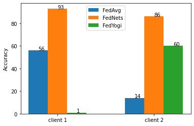

# FedNets : Federated Learning on Edge Devices using Ensembles of Pruned Deep Neural Networks

Federated Learning (FL) is an innovative area of machine learning that enables different clients to collaboratively generate a shared model while preserving their data privacy. In a typical FL setting, a central model is updated by aggregating the clients' parameters of the respective artificial neural network. The aggregated parameters are then sent back to the clients. However, two main challenges are associated with the central aggregation approach. Firstly, most state-of-the-art strategies are not optimised to operate in the presence of certain types of non-iid (not independent and identically distributed) applications and datasets. Secondly, federated learning is vulnerable to various privacy and security concerns related to model inversion attacks, which can be used to access sensitive information from the training data. To address these issues, we propose a novel federated learning strategy FedNets based on ensemble learning. Instead of sharing the parameters of the clients over the network to update a single global model, our approach allows clients to have ensembles of diverse-lightweight models and collaborate by sharing ensemble members. \textcolor{red}{FedNets utilises graph embedding theory to reduce the complexity of running Deep Neural Networks (DNNs) on resource-limited devices. Each Deep Neural Network (DNN) is treated as a graph, from which respective graph embeddings are generated and clustered to determine which DNN should be shared with other clients. Our approach outperforms state-of-the-art FL algorithms such as Federated Averaging (Fed-Avg) and Adaptive Federated Optimisation (Fed-Yogi) in terms of accuracy; on the Federated CIFAR100 dataset (non-iid), FedNets demonstrates a remarkable 63\% and 92\% improvement in accuracy, respectively. Furthermore, the privacy of the clients is not compromised, as it is safeguarded by the design of the method

## Accuracy Results goes here ( add the figures from the paper)

 

# Installation
- Create a virtual environment with conda/virtualenv or any other tool you prefer.
- Clone the repo.
- Run: `cd <PATH_TO_THE_CLONED_REPO>`.
- Run: `pip3 install -r requirements.txt` to install necessary packages and path links.

# Reproduce Paper Results on Federated CIFAR100 dataset
## Ensemble Generation
- Run: `cd <PATH_TO_THE_CLONED_REPO>/ensyth_pool/pruning/`.
- Create a new folder 'pruned_models'.
- Run: `python generate_hyperparams.py`; this will generate a CSV file 'constant_spar_hyperparams.csv'.
- Run: `python constant_sparsity.py`; this will generate a pool of pruned models in 'pruned_models' folder. 
- Copy the the folder 'pruned_models' to `<PATH_TO_THE_CLONED_REPO>/ensyth_pool/clustering/`.

## Ensemble Pruning
- Run: `cd <PATH_TO_THE_CLONED_REPO>/ensyth_pool/clustering/`.
- Create a new folder 'cluster_folder'.
- Run: `python generate_cluster.py`; the output of this command is a CSV file 'acc_results.csv'
- Run `python cluster_acc_createFolders.py` to generate a folder that divides the pruned models into different folders (based on the resulted clusters). The number of folders refers to the number of clusters.
- Copy the content of the following folder: 'cluster_folder' to `<PATH_TO_THE_CLONED_REPO>/scripts/clients/`. If 'clients' folder does not exist, then create it.
## FedNets Generation
- Run: `cd <PATH_TO_THE_CLONED_REPO>/scripts/`.
- Run: `python edge_client_api.py`
- Open a new terminal (make sure that the virtualenv is activated and you still in `<PATH_TO_THE_CLONED_REPO>/scripts/`.
- Run `./main_commands.sh`. The output of the scripts is stored in 'python_output.txt'

